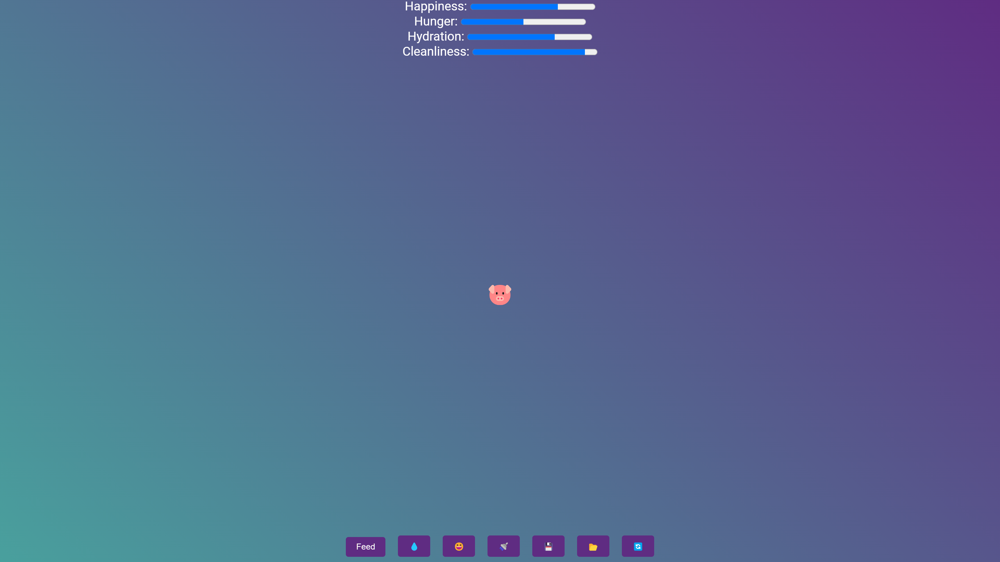

# 🐶Pet Caring Game
## 📝Description
This is a pet caring game. You can feed, play, and clean your pet. You can also check your pet's status and see how your pet is doing. Sort of a virtual Tamagotchi.
## 📷Screenshot

## 📃Features
- A large collection of pets to choose from
- If you don't know what pet to choose, you can let the game choose a random pet for you
- You can feed, play, and clean your pet
- You can export your game data to a file and import it back, so you can continue playing from where you left off
- It's an installable PWA (Progressive Web App), so you can install it on your device and play it offline
- It's made in vanilla ES6 JavaScript, with no external libraries or frameworks. Just clone the repo and host it on a server, and it will work :D
## 🌐Browser Compatibility
- Chrome 31+ (yes, you read that correctly!)
- Firefox 27+. In Firefox 33+, service workers are disabled by default, but it can be enabled in "about:config" by setting "dom.serviceWorkers.enabled" to "true"
- Safari 9+
- Opera 10+ (Presto rendering engine) with TLS 1.2 enabled. With Opera versions based on the Chromium/Blink rendering engine, the same rules for Chrome apply
- IE 11 with "Check for publisher's certificate revocation" and "Check for server certificate revocation" disabled

It might work on other browsers, but I haven't tested it on them.
